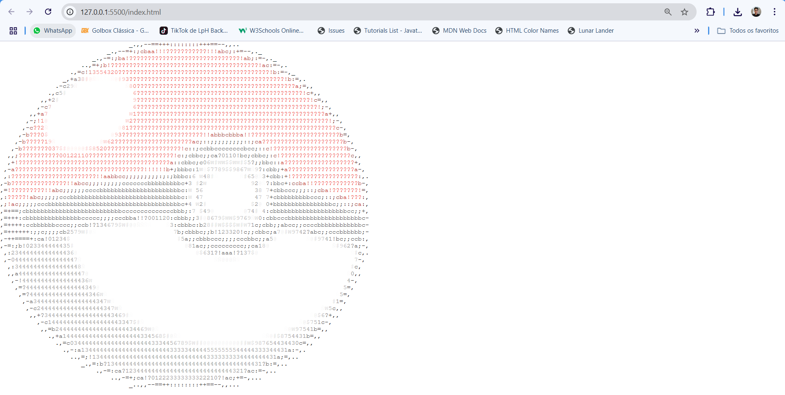
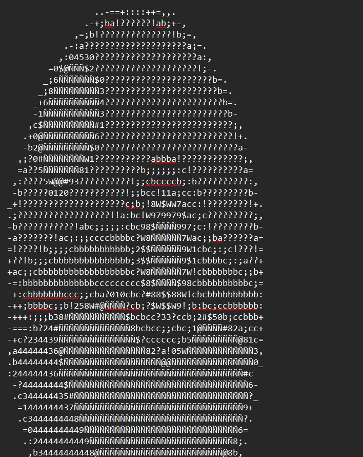
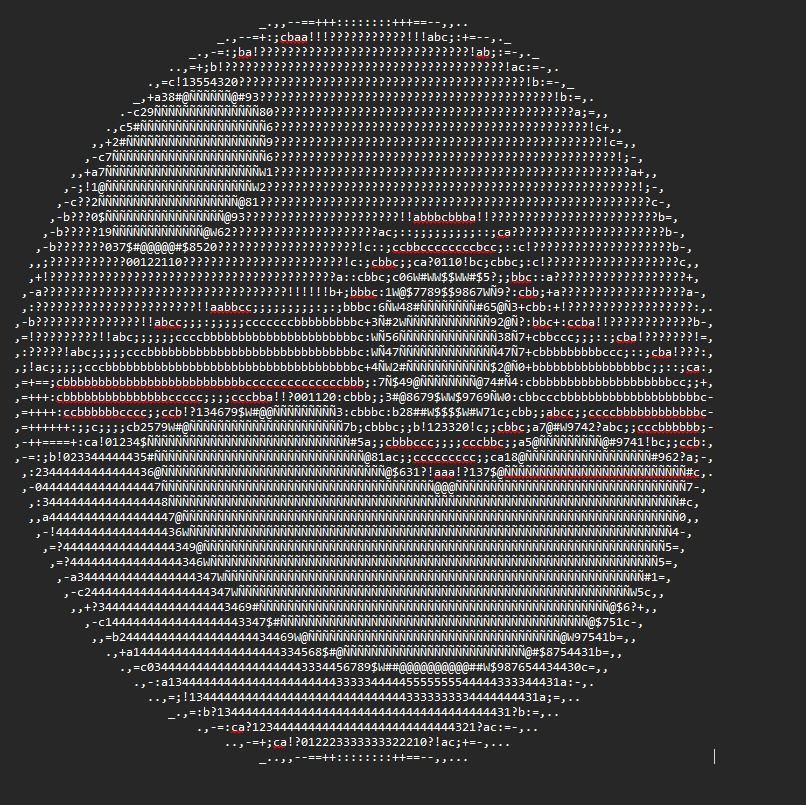
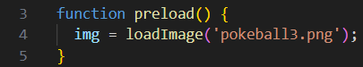

# ASCII - POKEBALL

To use this project, I recommend always using an image with the same height and width values, then resizing it to 100x50, since characters do not occupy the same amount of space horizontally and vertically.

[View on pages](https://imoutofbounds.github.io/ASCII---POKEBALL/)


Result using a 50x50 image


Result using the same image, but resized to 100x50


The image can be changed by modifying the parameter inside the ```preload()``` function, which can be found in sketch.js.

